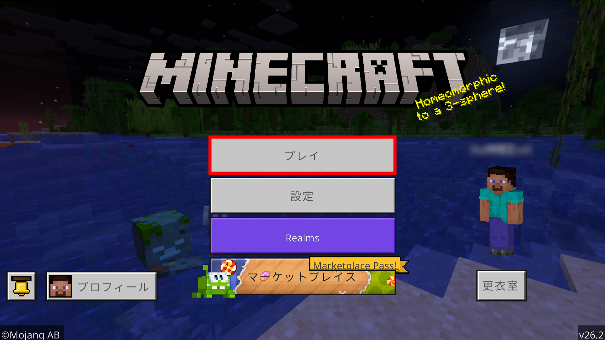
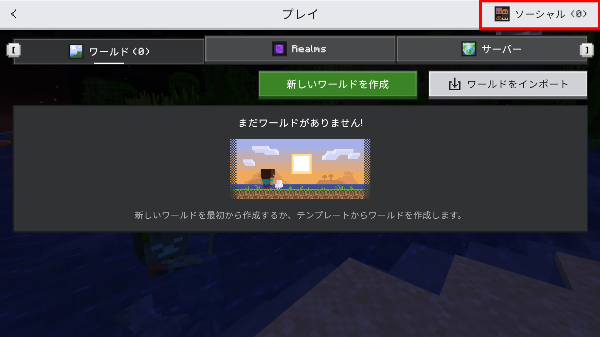
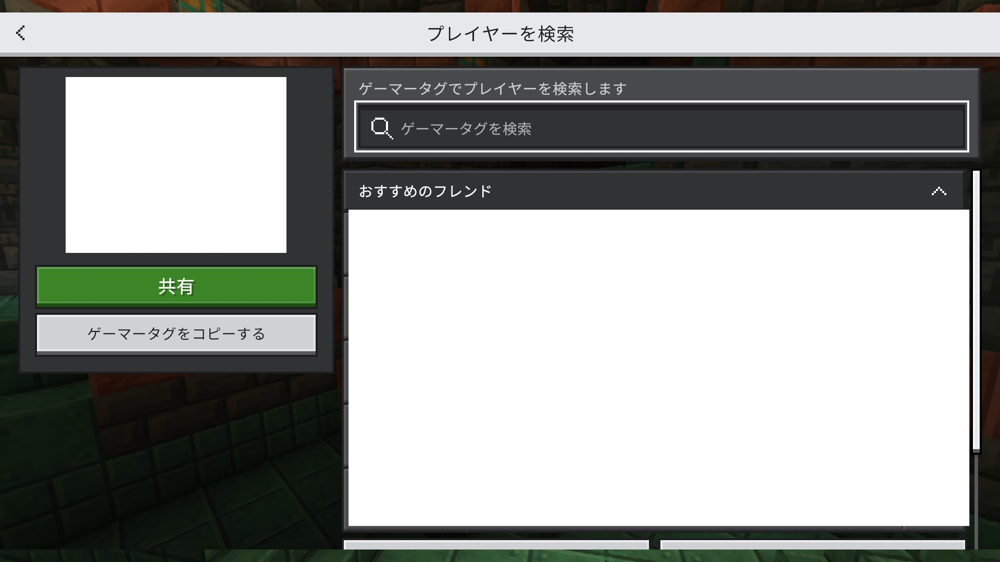
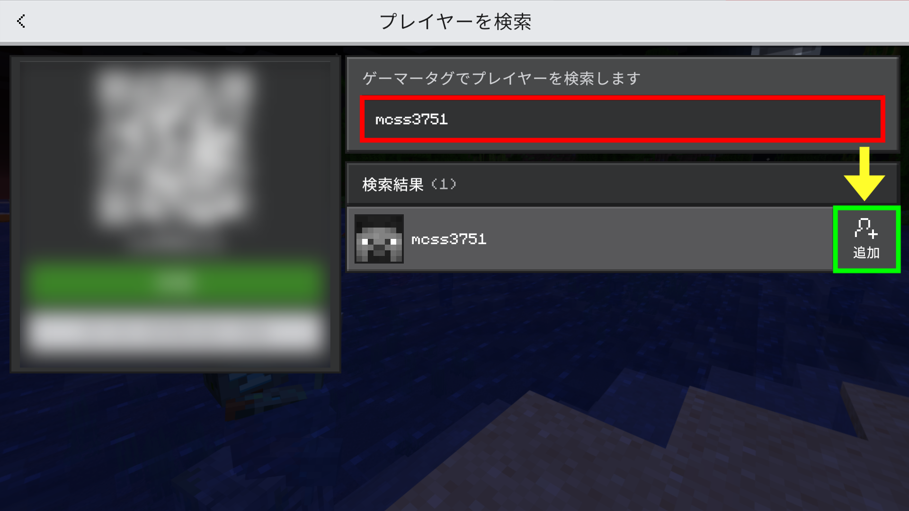

# 統合版の場合

## 参加情報

ゲーマータグ　`mcss3751`

## 参加方法

1. Minecraftを起動し、**プレイ**を押します。

<figure><figcaption></figcaption></figure>

2. **ソーシャル**を押します。

<figure><figcaption></figcaption></figure>

3. **プレイヤーを検索**を押します。

<figure><figcaption></figcaption></figure>

4. `mcss3751` を**検索**し、**追加**を押します。

<figure><figcaption></figcaption></figure>

5. `mcss3751` のワールドが出てきます。サーバーに接続して、RoomServerに**参加**しましょう！

<figure><figcaption></figcaption></figure>