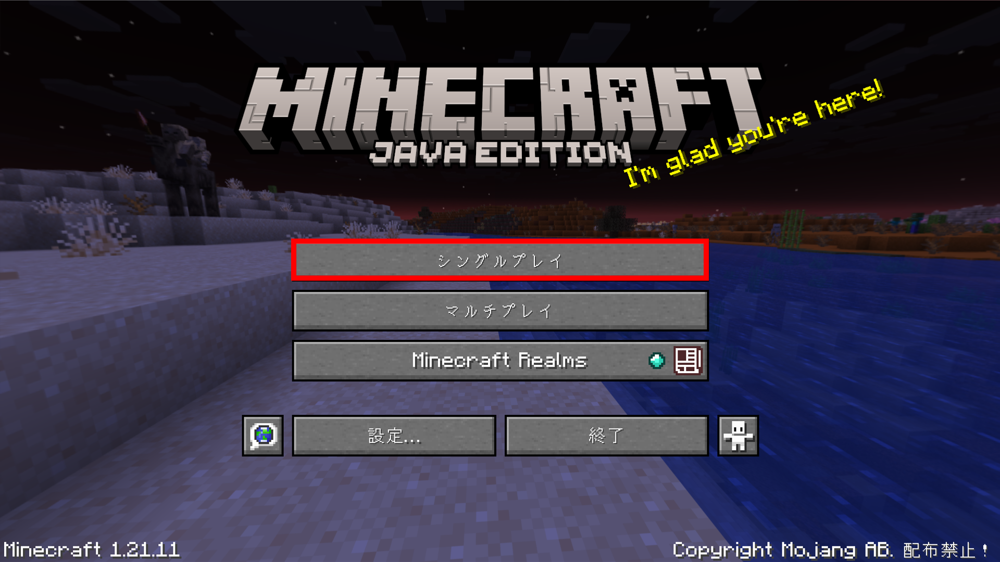
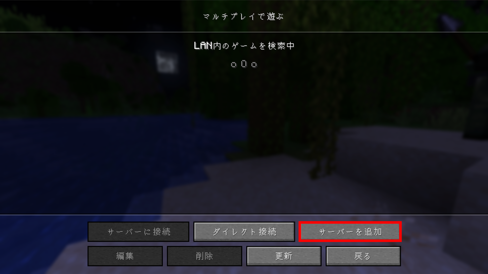
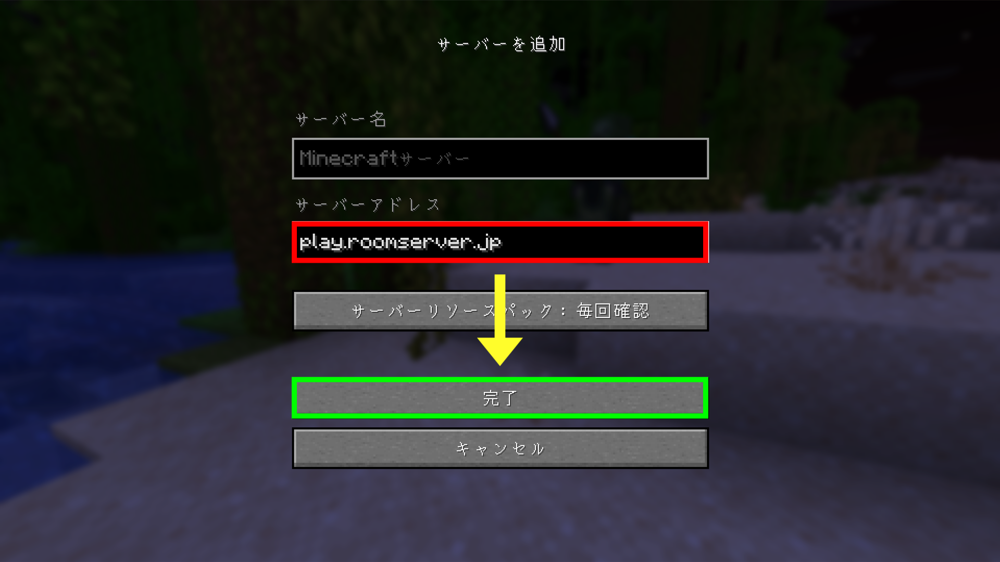

# JAVA版の場合

## 参加情報

`play.roomserver.blog`

## 参加方法

1. Minecraftを起動し、**マルチプレイ**を押します。

<figure><figcaption></figcaption></figure>

2. **サーバーを追加**を押します。

<figure><figcaption></figcaption></figure>

3. `play.roomserver.jp` を、サーバーアドレスの欄に**入力**し、**完了**を押します。

<figure><figcaption></figcaption></figure>

4. サーバーに接続して、RoomServerに**参加**しましょう！