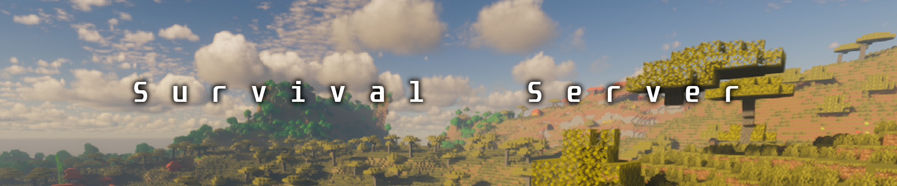

# なんでもありサバイバル鯖（新リリース！）

<figure><figcaption></figcaption></figure>


**ウィザー討伐について**
利用規約には特定のMOBの無許可召喚を制限する項目がありますが、本サバイバルサーバーにおいては、ウィザー討伐の申請は原則として不要となりました。


## 説明

昔の参加型マイクラに帰ってきたような感覚で遊べる、サバイバルサーバーです。  
無法地帯というわけではなく、参加者が楽しく遊べるような環境を作っています。  
他の人の要望をもとにメンテナンスを繰り返し、サーバーをよりよくしていく予定です。

## 特徴

* 好きな勢力に参加して、チームの人たちと協力できる！
* 他の勢力に宣戦布告をし、戦うことができる！
* 皆が快適に街を作ったりするための高スぺサーバーを使っている！

## 戦争ルール規定

### 第1条（宣戦布告の手順）

1. 戦争を行うには、攻撃側が`/war fukoku`を使用し、正式な宣戦布告を行わなければなりません。

2. 宣戦布告後、防衛側が`/war accept`もしくは`/war deny`を使用し、合意、もしくは拒否することが出来ます。  
防衛側は宣戦を受け取ってから合理的な時間内（24時間以内）に応答することが望ましいです。

### 第2条（禁止行為）

以下の行為を**禁止**とします。  
違反が確認されたチームがあった場合は、**即時敗北**とします。  
また、違反したメンバーが**ペナルティ**を受けることがあります。

* **合意前の戦闘行為**  
	必ずコマンドでの合意があった後に、戦闘を開始するようにしてください。

* **不正ツール・チート行為**  
	例えば、以下のようなMODの使用は禁止です。
	
	* 移動しながらインベントリ欄を操作するMOD
	* 通常プレイとは異なる視点の使用するMOD
	* トーテムを自動で補充するMOD
	
	**ただし、相手の体力を可視化するMODは許可されています。**
    
* **意図的な破壊行為**  
	戦争の範囲を超えた破壊活動は重大な規約違反として扱います。  
	**戦闘の巻き添えによる破壊については、第5条を参照してください。**

* **第三者が戦争へ介入する行為**  
	戦争に参加できるのは、合意時にシステムで選択された参加者のみとします。  
	選択されていないプレイヤーが戦闘に介入することは禁止です。  
    他プレイヤーに物資・装備・戦力の支援を依頼する行為も禁止となっています。

* **戦争を意図的に引き延ばす行為**
	* 極度な戦闘の回避
	* 不当な立てこもり
	* ログアウトによる死亡回避  

* **降伏後に攻撃を継続する行為**  
	降伏については、第4条を参照してください。

### 第3条（勝敗の決定）

勝敗はMODのシステムに従います。  
リーダーが復活回数（最大3回）を使い切った状態で、死亡すると勝敗が決定します。  
システムによる判定が最優先であり、これに異議を唱えることはできません。

また、管理者が`/war end`を使用して戦争を強制終了する場合があります。  
その場合は状況を管理者が判断し、勝敗を決定します。

なお、両クランで独自ルールを設定していた場合は、  
勝敗が決定した時点で敗者側のリーダーが`/war cancel`を使用し、戦争を終了してください。

### 第4条（降伏）

敗北が確実な場合は、リーダーが相手リーダーに対して降伏の意思を表明することができます。  
降伏の意思が表明された場合、勝者側はこれを速やかに受け入れなければなりません。  
**降伏後の扱いについては、第6条の賠償ルールが適用されます。**

### 第5条（賠償・戦後処理）

勝者は敗者に対して、以下の範囲内で賠償を要求することができます。

* 賠償
    * 一定期間（最長７日間）の特定区域への立ち入り制限
	* アイテムの譲渡（事前に双方が合意した場合のみ）
	* クランの解散（事前に双方が合意した場合のみ）

* 戦後処理
	* 戦争により破壊された地形および建物については、両チームで修復を行うことを義務とします。
	* 地形の修復に使用する物資は、**土のみ**運営が補填をすることとします。

**ただし、賠償内容は宣戦布告の際に備考欄へ明記することが強く推奨されます。**  
明記のない賠償要求については、相手が拒否することができるためです。  
また、ゲームプレイを著しく損なうような過大な要求は管理者が**却下**することができます。

### 第6条（管理者の権限）

管理者は以下の権限を持っています。

* `/war end`の使用による戦争の強制終了
* 規約違反プレイヤーへのペナルティ付与
* 独自ルールの解釈に関する最終決定

**管理者の判断に対して正当な理由なく異議を唱え続ける行為は、それ自体が違反とみなされる場合があります。**

## 公共施設の保護

公共施設の保護は、申請が必須です。  
**未申請の施設は保護対象外となり、自己責任となります。**  
保護が可能な条件は以下の通りです。  
* 誰でも利用可能
* 純粋な建築、利便目的
* トラップ、自動化装置ではない
* 他者に損害を与えない

## 安全地帯（保護エリア）

保護エリアは、初期スポーンから**半径2チャンク以内**となっています。  
このエリア内でのPvP行為、破壊行為、窃盗行為は**禁止**とします。

## 導入Mods一覧

| Mod名        | 説明 |
| ----------------------------------------------------------- | -------------------------- |
| [CyanSetHome](mods-info/survival/cyansethome.md)            | 設定したホームへテレポートができます。 |
| [DeclarationCore](../mods-info/survival/declarationcore.md) | 戦争・勢力に関するシステムを管理できます。 |
| [Pricate Chests](../mods-info/survival/private-chests.md)   | チェストを保護することができます。 |
| [squaremap](../mods-info/survival/squaremap.md)             | Web上でワールドの全体マップを見ることができます。 |
| [WorldGuard](../mods-info/survival/worldguard.md)           | 範囲内の建造物を保護できます。 |